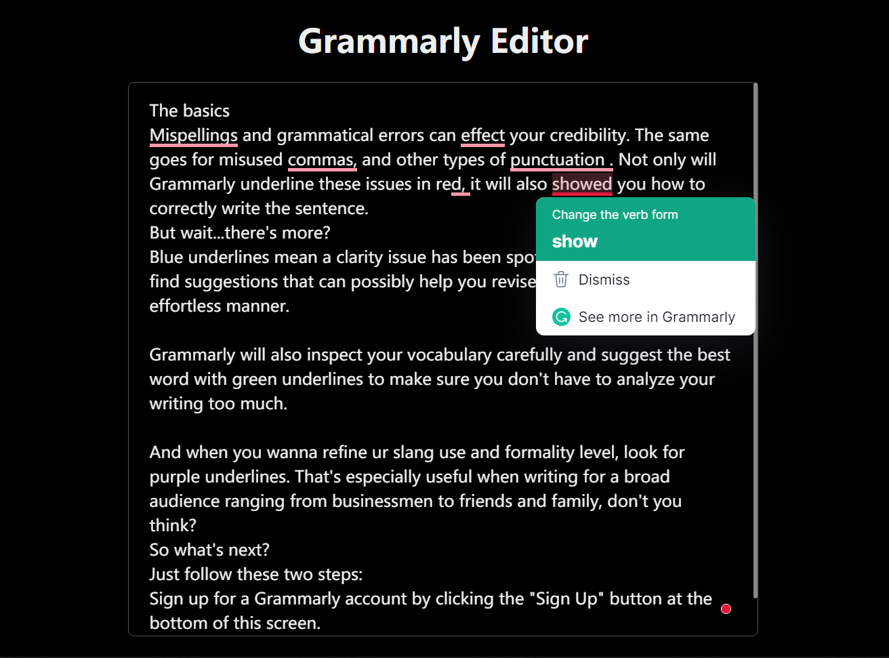

# Minimal Grammarly Editor

_Please make sure to install [Grammarly for Chrome](https://chrome.google.com/webstore/detail/grammarly-for-chrome/kbfnbcaeplbcioakkpcpgfkobkghlhen) first._

## Features

Uses Grammarly for English checking, supports auto-saving for content and caret position.

When multiple editors are opened, their content and caret position are automatically synced when switching between them.

[Live link](https://wenfangdu.github.io/grammarly-editor/)

Screenshot:

If you like this editor, a 🌟 will be very appreciated :D.
